# Valendo — A Teleprompter Suite

**Everything a teleprompter operation needs, in one app.** Script, timing, cards, monitors and the local network — and you can rewrite any of it while the show is on the air.


**[valendo site →](https://samabr85.github.io/Valendo-TeleprompterSuite/)** · **[Documentation is in the wiki →](https://github.com/samaBR85/Valendo-TeleprompterSuite/wiki)**

---

## Six things a show needs

| | |
|---|---|
| **The script** | Import `txt` `md` `docx` `pdf`, up to ten tabs, chapters, stage directions, markers, undo that survives closing the app |
| **Timing** | Words per minute on a ruler, elapsed and remaining, a target duration the pace bends to meet, loop with a delay |
| **The presenter's screen** | Any connected monitor, identified before you send a show to it, mirrored or rotated to suit the glass, and it survives being unplugged |
| **Cards** | Images, video, messages, and standby screens the app draws itself — replacing the script or riding over it |
| **The network** | One switch and any device on the wi-fi is a second prompter screen |
| **The console** | Three working layouts, a command palette, remappable keys, interface zoom, six languages |

---

## The part every operator has wanted

The left panel is the script. The right panel is **what the presenter is seeing right now**, at the output's real resolution. You type in one and the other changes — with the show live.

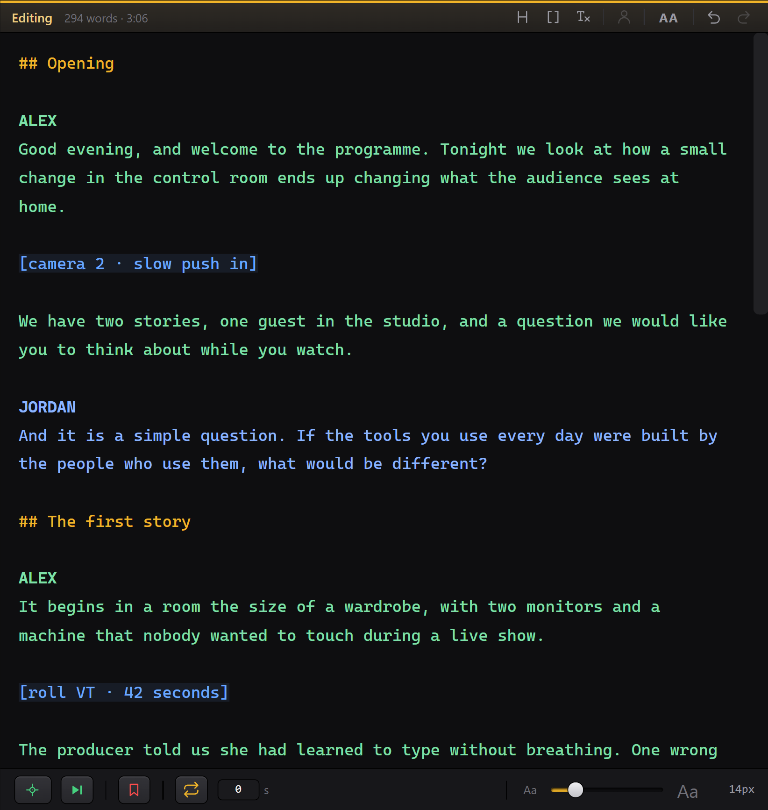

No other prompter lets you do this, and the reason is technical: they store the reading position **in pixels**. Change the text, the typeface or the margin and the layout reflows — pixel 4,200 is suddenly a different sentence, and the text jumps in the presenter's face. So those apps make you leave the presentation screen to edit.

Here nothing jumps. Fix a typo three paragraphs above the reading line, raise the type size, widen the margin: the word being read stays exactly where it is. That is what makes editing on air a normal thing to do instead of a stunt.

Two marks are all the markup there is — `##` opens a chapter, `[square brackets]` make a stage direction that is never counted as words to be spoken.

Each tab is a separate script with its own appearance and markers, and only the active one goes on air. Right-click one to duplicate it — the rehearsed version and the one about to run, side by side — to rename it, or to close it. Drag them to put the running order in the order it will actually run.

<p align="center">
  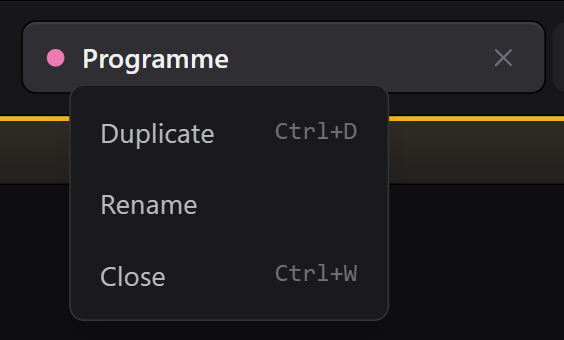
</p>

<p align="center">
  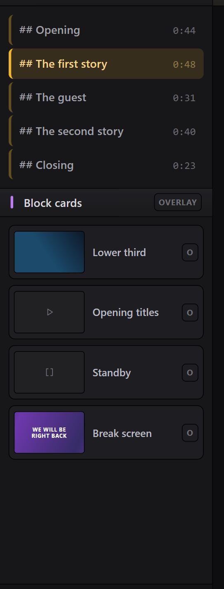
  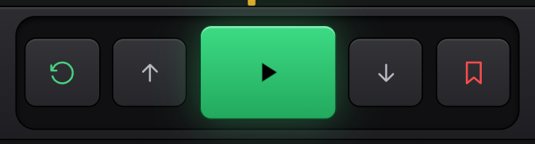
  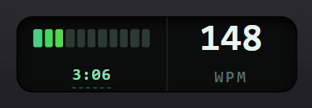
</p>

---

## Any device on the wi-fi is a prompter screen

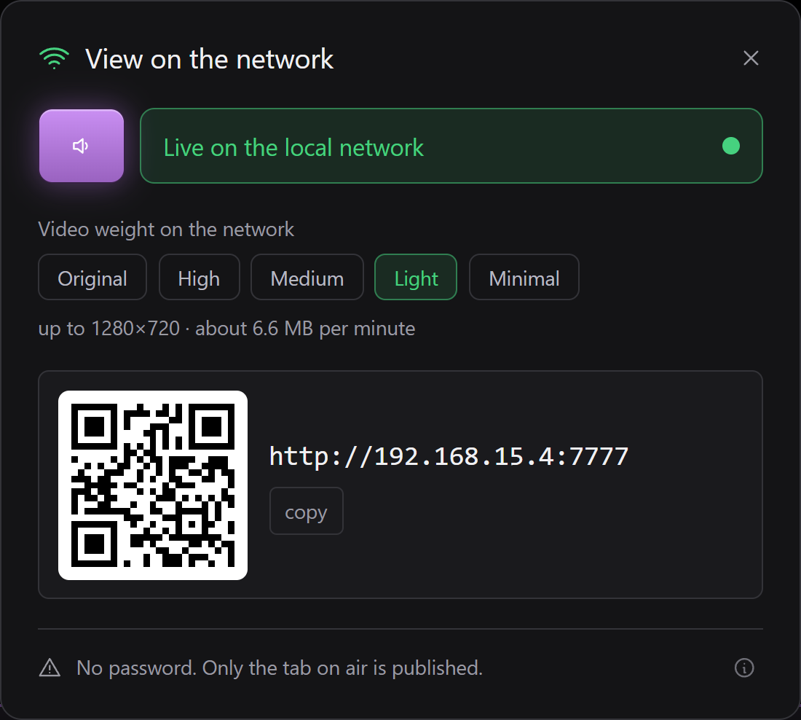

Flip one switch and the reading is published to a page on your own network. Scan the QR code, or type the address into any browser, and that screen is following the same script, at the same word, cards included. Nothing to install, nothing to pair, no cable across the studio.

That is the director, the floor manager, the presenter rehearsing in the dressing room, and camera two on the far side of the room — all reading the same thing, on hardware they already have: a phone, a tablet, a spare laptop.

**It is the reading that travels, not a video feed.** No NDI, no SDI, no screen capture: the same page redraws itself in each browser. That is why it works on ordinary wi-fi, and why card video has five weight profiles — the network can be told to send something lighter while the presenter's screen always gets the original.

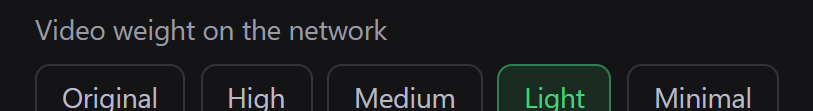

---

## Cards over the script, or instead of it


Images, video, messages and screens reach the presenter's screen with one click or a number key. Each card either **replaces** the script or **rides over it**, which is how a lower third and a caption share the same screen. Legibility over a card is a three-way choice: dark band, per-letter shadow, or nothing.

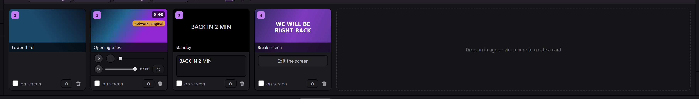

Video plays the file as it arrived whenever the browser can handle it. When it cannot, ffmpeg first tries to change only the container — seconds, no pixel touched — and re-encodes only when the content genuinely will not fit an mp4.

---

## A standby screen without opening Photoshop

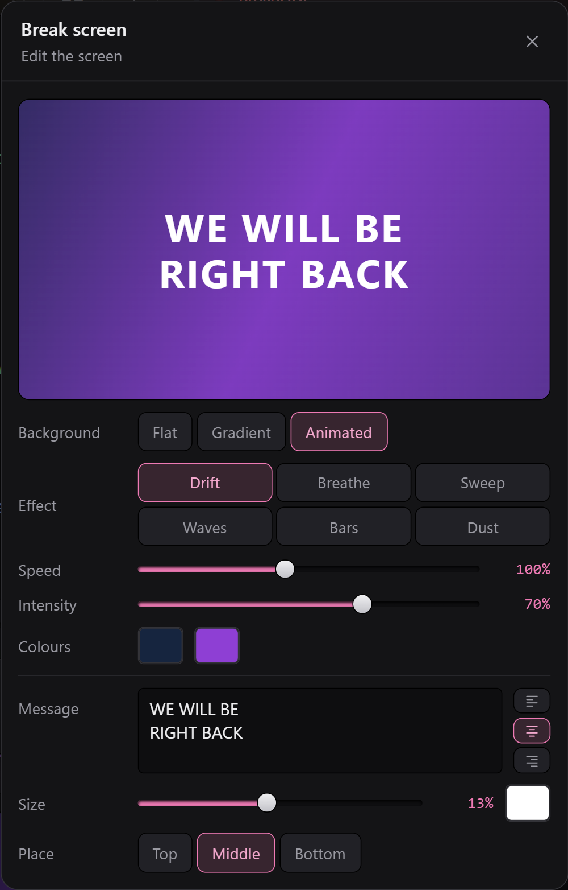

The fourth kind of card is one **the app draws itself**. A colour, or two colours and an angle, or one of six slow animated backgrounds — drift, breathe, sweep, waves, bars, dust — with a message over it if you want one. Nothing to import, nothing to keep beside the project, nothing to break when a folder moves.

That is the real difference, and it is not about looks: an image card points at a **file**, a screen card is a **handful of numbers**. It weighs nothing inside the `.valendo`, has no link that can go stale, needs no lighter copy made for the network, and the same numbers draw it at 176 pixels in the drawer and at full resolution on the presenter's monitor.

The six effects are slow on purpose — a restless background argues with whoever is reading — and two sliders scale the whole set at once: how fast it moves, and how much the movement shows over the base colour.

<p align="center">
  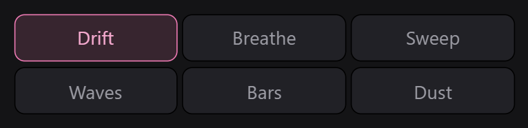
</p>

---

## The presenter's screen


Pick a monitor, flash a number on each screen to be sure which is which, then send the show. Mirror on either axis for a beamsplitter, rotate 90° for a portrait panel, black out or freeze at any moment. Unplug the monitor mid-show and the app keeps going.

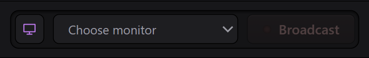

**Dim the edges** fades the script away from the line being read, so the presenter's eye has one place to land. The clear window follows the reading mark wherever you put it, and a slider decides how wide it stays — from most of the screen at the low end down to a band about one line tall at the top.

<p align="center">
  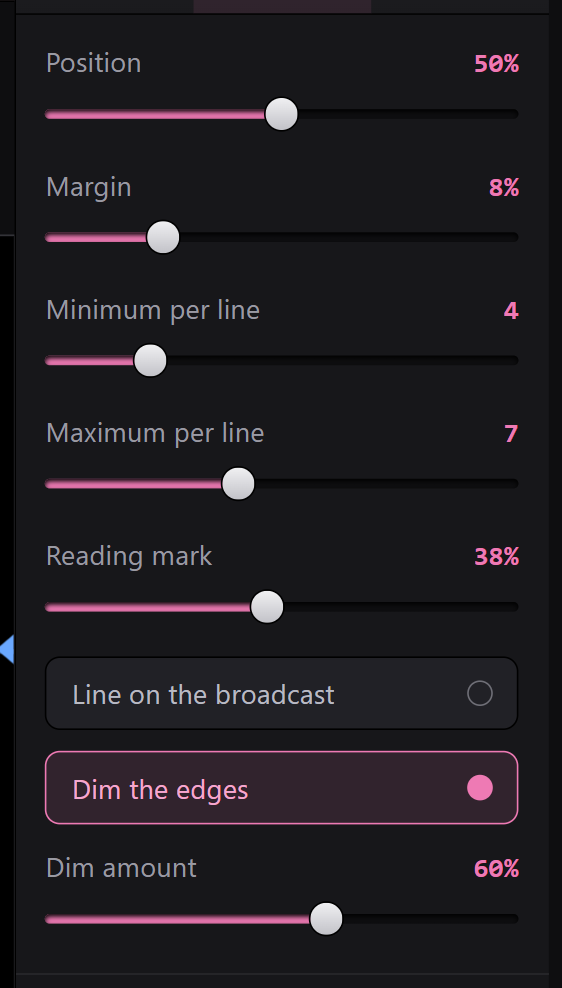
</p>

---

## Three ways to work

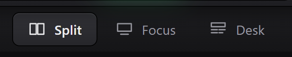

**Split** is the picture at the top of this page. **Focus** hides everything except the script and the transport. **Desk** turns the script into a rundown with a timeline.


Every appearance control is live while the show runs — family, size, weight, line height, letter spacing, ALL CAPS, margin, horizontal position, words per line, alignment, colour presets, edge dimming.

<p align="center">
  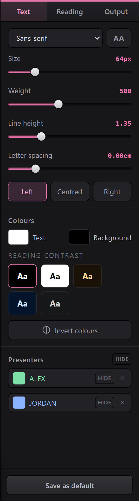
</p>

---

## It opens without opening your work


The app never restores the last script by itself. Opening Valendo in someone else's studio, or with the screen already mirrored to a wall, would otherwise reveal the previous show without anyone asking — and a script is a client's material. The screen starts blank and **Pick up where I left off** is a deliberate click.

It also greets you in the language of your operating system, and lets you change it right there.

<p align="center">
  
</p>

---

## Feature list

| Area | What is there |
|---|---|
| Reading | Semantic anchor, word-rule line composition, reading line, adjustable edge dimming, chapters, markers, go-to-cursor |
| Transport | Play/pause, WPM ruler, nudge, seek by words, restart, loop with delay, auto-pause at the end |
| Pacing | Formula (words ÷ WPM), stopwatch, free run; elapsed, remaining and target duration |
| Appearance | Family, size, weight, line height, letter spacing, ALL CAPS, margin, horizontal position, words per line, alignment, colour presets, invert, reading-contrast swatches |
| Output | Monitor picker, identify displays, hot-plug survival, mirror X/Y, rotation, blackout, freeze |
| Cards | Image, video, message, screen; overlay per card and globally; band/shadow/none; drag to reorder; video scrub, loop, volume, relink |
| Screens | Flat, gradient with angle and fade distance, six animated backgrounds; speed and intensity; message with size, colour, alignment and placement |
| Network | Local page with QR, five video weight profiles, only the on-air tab is published |
| Files | Import `txt` `md` `docx` `pdf`; export `txt` `md` `docx` `pdf`; `.valendo` projects; recent projects; autosave |
| Editing | Infinite undo, persisted across sessions; strip formatting; up to 10 tabs, duplicated or dragged into order |
| Console | Command palette, remappable keys, UI scale, transport at the top or in the footer bar |
| Languages | English, Portuguese (Brazil), Spanish, German, French, Italian |

---

## How it can do that

The reading position is a **semantic anchor**: `{ blockId, wordOffset }` — a place in the text, not a pixel on the screen. After any reflow the pixel is recomputed from it, which is why inserting paragraphs above the reading point, raising the type size or changing the margin does not move the word being read.

[The Reading Anchor](https://github.com/samaBR85/Valendo-TeleprompterSuite/wiki/The-Reading-Anchor) explains what follows from that — a clock instead of messages, one component drawing both screens, and lines composed by words rather than by the browser.

---

## Install

**Windows** — run the `-setup.exe` from [Releases](https://github.com/samaBR85/Valendo-TeleprompterSuite/releases). It installs per user, so it does not ask for an administrator password. SmartScreen warns about an unrecognised publisher; **More info → Run anyway**.

**macOS, Apple Silicon** — open the `.dmg`, drag Valendo to Applications, then run this once in Terminal:

```bash
xattr -dr com.apple.quarantine /Applications/Valendo.app
```

It prints nothing and asks for nothing. Silence means it worked, and that copy of Valendo opens normally from then on.

Do this **before** the first launch, and **again for every version you download**. The quarantine flag is put there by the browser, on that particular file — a new download is a new file, so it arrives flagged again. It is not macOS forgetting your decision.

Without it macOS says *"Valendo is damaged and can't be opened"* and offers only **Move to Bin** — the app is not damaged; that is the message macOS gives a downloaded app it cannot verify with Apple, and the dialog even names the browser that downloaded it. There is no **Open Anyway** button to click in this case: that one appears only when macOS warns, and here it refuses outright.

**If you update often, skip the dance:** download with `curl` instead of a browser. Files fetched from the command line never get the quarantine flag, because it is the browser that applies it.

```bash
curl -L -o ~/Downloads/Valendo.dmg \
  https://github.com/samaBR85/Valendo-TeleprompterSuite/releases/latest/download/Valendo-1.4.1-arm64.dmg
```

The reason is that the app is **not notarised**. It is signed ad-hoc, which is what lets it run at all on Apple Silicon, but Apple's notarisation stamp requires a paid developer account this project does not have. Building from source has no such block, because nothing was downloaded.

**Intel Macs** are not shipped as a download. The app builds and runs on them — see [Building from Source](https://github.com/samaBR85/Valendo-TeleprompterSuite/wiki/Building-from-Source) — but the CI runners for Intel macOS are scarce enough that the build never got a machine, and an installer that cannot be produced reliably is not an installer.

**From source** —

```bash
npm install
npm run dev
```

Everything else a contributor needs — the other commands, the project layout, the tests, where user data lives — is in [Building from Source](https://github.com/samaBR85/Valendo-TeleprompterSuite/wiki/Building-from-Source).

---

## Licence

GNU General Public License, version 3 or later — the full text is in [LICENSE](LICENSE).

In plain words: you may use, study, modify and redistribute Valendo freely, including in a studio that charges for the work. The one obligation appears when you **distribute** a modified version — its source has to travel with it, under this same licence.

That is the intent of the project: it was born to stay free. The GPL does not stop anyone from charging, but it does stop anyone from closing the source and turning this into a proprietary product.

The installer redistributes a **GPL build of ffmpeg 6.1.1**; the corresponding source and build flags are listed in [Building from Source](https://github.com/samaBR85/Valendo-TeleprompterSuite/wiki/Building-from-Source#redistributed-ffmpeg).
