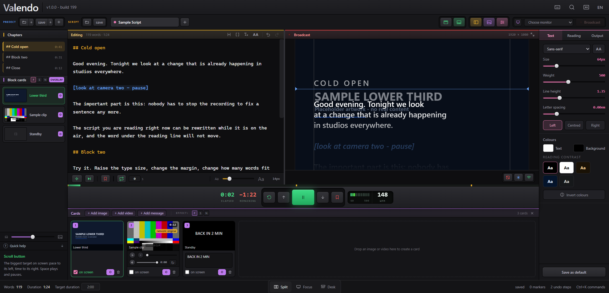
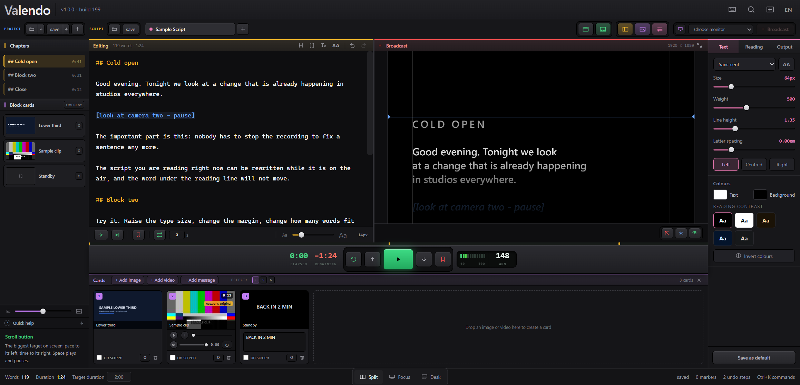
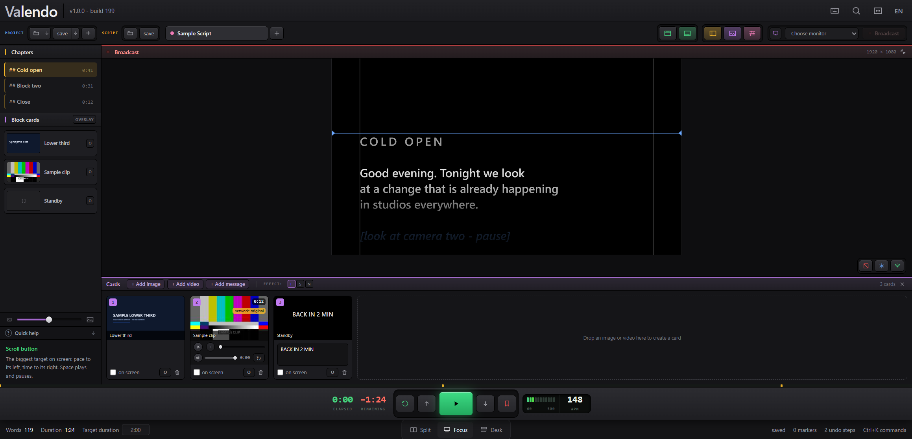
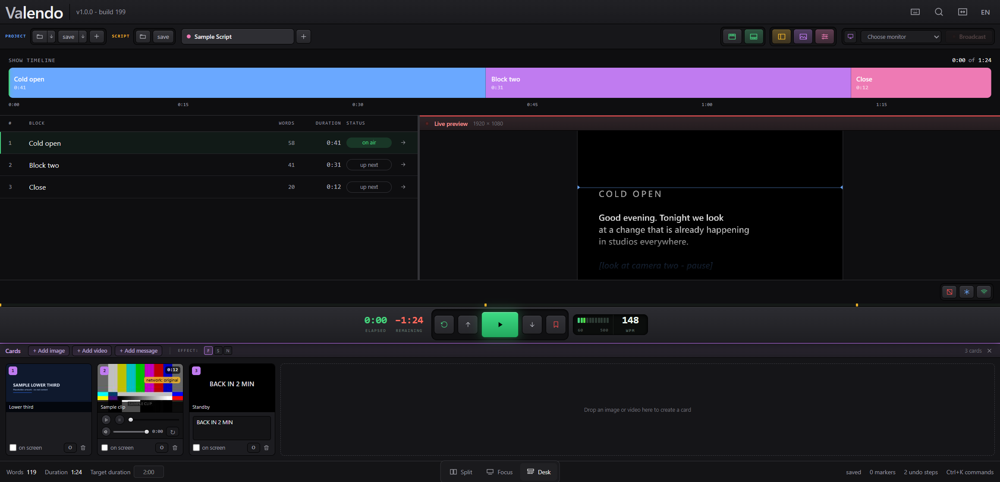
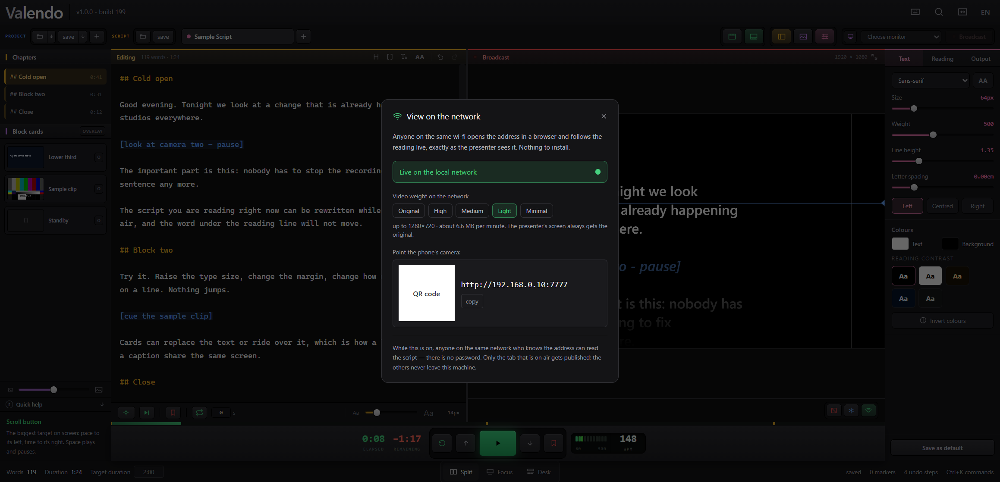

# Valendo — A Teleprompter Suite

A teleprompter for Windows and macOS where the operator **rewrites the script while the show is on the air**, watching the editor and an exact replica of the presenter's screen side by side.

> The reading position is an anchor in the text, not a pixel on the screen.


Free software under the GPL — see [Licence](#licence).

---

## Why it exists

Ordinary teleprompters store the scroll position **in pixels**. Any change to the text, the typeface or the margin reflows the layout, and pixel 4,200 is suddenly a different sentence — the text jumps in the presenter's face. That is why those apps make you leave the presentation screen to edit.

Here the position is a **semantic anchor**: `{ blockId, wordOffset }`. After any reflow the pixel is recomputed from it. Inserting paragraphs above the reading point, raising the type size or changing the margin does not move the word being read.

Three design consequences follow:

- **A clock, not messages.** The main process keeps only `{ppm, wordsAtStart, startedAt}`; each window derives its own position inside a `requestAnimationFrame`. No per-frame traffic, no drift between the preview and the output.
- **One component.** `PrompterCanvas` draws the broadcast *and* the operator's preview. The preview runs at the output's real viewport and only gets a `scale()`. The replica is exact by construction, not by calibration.
- **Line composition independent of the font.** Lines are composed by a word rule (min/max, never ending on a preposition), not by the browser. Changing the type size changes the height, never which words land on which line.

---

## What it does

### Live editing, on air

The left panel is the script; the right panel is what the presenter sees, at the output's real resolution. Chapters open with `##`, stage directions go in `[square brackets]` and are painted, never spoken aloud by the count. The footer keeps word count, duration and target duration in view.

### Cards over or under the text



Three kinds of card — image, video, message — go to the presenter's screen with one click or a number key. Each card either **replaces** the script or **rides over it**, which is how a lower third and a caption share the same screen. Legibility over a card is a three-way choice: dark band, per-letter shadow, or nothing.

Video plays the file as it arrived whenever the browser can handle it — most phone `.mov` files play untouched. When it cannot (ProRes, matroska, avi), ffmpeg first tries to change only the container, which takes seconds and does not touch a pixel, and re-encodes only when the content genuinely will not fit an mp4.



### Three ways to work

**Split** is the picture above. **Focus** hides everything except the script and the transport, for the last rehearsal before air.



**Desk** turns the script into a rundown: blocks with word counts, durations and on-air status, and a timeline across the top.



### The presenter's screen


Picks any connected monitor, identifies which is which on screen, survives a monitor being unplugged mid-show. Mirror on either axis, 90° rotation, blackout and freeze.

### Anyone on the wi-fi can follow along



One switch publishes the reading to a local page. A phone points its camera at the QR code and follows the same scroll, cards included. Video going to the network can be throttled to five weight profiles; the presenter's screen always gets the original.

### It opens without opening your work


The app never restores the last script by itself. Opening Valendo in someone else's studio, or with the screen already mirrored to a wall, used to reveal the previous show without anyone asking — and a script is a client's material. The screen starts blank and **Pick up where I left off** is a deliberate click.

---

## Feature list

| Area | What is there |
|---|---|
| Reading | Semantic anchor, word-rule line composition, reading line, chapters, markers, go-to-cursor |
| Transport | Play/pause, WPM ruler, nudge, seek by words, restart, loop with delay, auto-pause at the end |
| Pacing | Formula (words ÷ WPM), stopwatch, free run; elapsed, remaining and target duration |
| Appearance | Family, size, weight, line height, letter spacing, ALL CAPS, margin, horizontal position, words per line, alignment, colour presets, invert, reading-contrast swatches |
| Output | Monitor picker, identify displays, hot-plug survival, mirror X/Y, rotation, blackout, freeze |
| Cards | Image, video, message; overlay per card and globally; band/shadow/none; drag to reorder; video scrub, loop, volume, relink |
| Network | Local page with QR, five video weight profiles, only the on-air tab is published |
| Files | Import `txt` `md` `docx` `pdf`; export `txt` `md` `docx` `pdf`; `.valendo` projects; recent projects; autosave |
| Editing | Infinite undo, persisted across sessions; strip formatting; up to 10 tabs |
| Console | Command palette, remappable keys, UI scale, transport at the top or in the footer bar |
| Languages | English, Portuguese (Brazil), Spanish, German, French, Italian |

Machine preferences (window size, panel widths, thumbnail size, UI scale) are kept apart from the project, so a `.valendo` sent to a colleague never resizes their console.

### Import cleanup

Text is cleaned before it becomes a script: a word hyphenated at a line break is rejoined, a line that was only a page break is merged, repeated headers and page numbers are dropped, quotes are straightened, and legacy encodings are detected — an old Windows-1252 `.txt` does not turn into a soup of diamonds.

In PDFs the text is rebuilt from fragment coordinates, two-column layouts included, and a sentence that crosses a page break comes back whole. A scanned PDF is flagged as such; OCR is the next milestone.

---

## Running from source

```bash
npm install
npm run dev
```

| Command | What it does |
|---|---|
| `npm run build` | Bundles main, preload and renderer into `out/` |
| `npm test` | Tests the pure logic in `src/shared` and `src/main` |
| `npm run typecheck` | Type check |
| `npm run start:debug` | Runs the built app with remote debugging on port 9222 |
| `npm run verify` | Checks the acceptance criteria against the running app (needs `start:debug`) |
| `npm run dist:win` | Builds the Windows installer (NSIS) into `dist/` |

If `npm install` does not fetch the Electron binary, run `node node_modules/electron/install.js`.

Windows users who do not have Node installed can double-click **Abrir Valendo.bat**, which installs and builds on the first run.

---

## Layout

```
src/main/       windows, monitors, authoritative state, persistence
src/preload/    the IPC bridge exposed to the renderer
src/shared/     pure, testable logic: anchor, lines, pacing, history, commands
src/renderer/   prompter (shared), operator interface, broadcast window
scripts/        end-to-end verification over the Chromium protocol
docs/           screenshots used here and in the wiki
```

User data lives in `userData`:

| File | What it holds |
|---|---|
| `workspace.json` | The last session, restored only when you ask for it |
| `history/<tabId>.jsonl` | Persisted infinite undo |
| `recentes.json` | Recent projects (per machine, never inside a `.valendo`) |
| `defaults.json` | How a new tab is born |
| `ui.json` | Interface scale |
| `keymap.json` | Remapped keys |
| `cartoes/`, `convertidos/` | Card artwork and playable video copies |

---

## Versioning

The semantic version is a human decision and sits at `1.0.0`. The build number rises on its own with every `npm run build`, and shows in the app header and credits as `v1.0.0 - build N`.

---

## Redistributed ffmpeg

The installer carries an ffmpeg along, through [`ffmpeg-static`](https://www.npmjs.com/package/ffmpeg-static) (version pinned in `package-lock.json`). It is a **GPL** build of ffmpeg 6.1.1, compiled by gyan.dev with `--enable-gpl --enable-version3 --enable-libx264` — compatible with this project's licence.

The corresponding source is at [ffmpeg.org/download.html](https://ffmpeg.org/download.html) and in the [official repository](https://git.ffmpeg.org/ffmpeg.git), tag `n6.1.1`.

---

## Licence

GNU General Public License, version 3 or later — the full text is in [LICENSE](LICENSE).

In plain words: you may use, study, modify and redistribute Valendo freely, including in a studio that charges for the work. The one obligation appears when you **distribute** a modified version — its source has to travel with it, under this same licence.

That is the intent of the project: it was born to stay free. The GPL does not stop anyone from charging, but it does stop anyone from closing the source and turning this into a proprietary product — whoever sells it must hand over the source and the same freedoms to the buyer.
