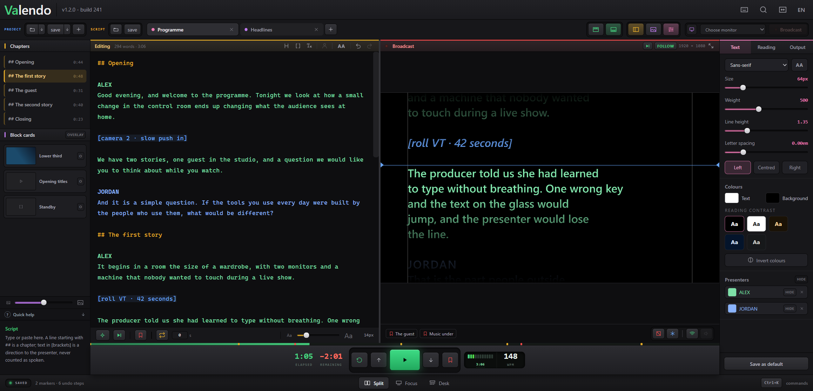
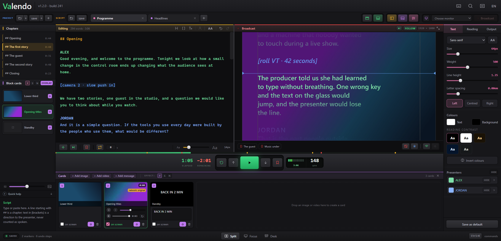
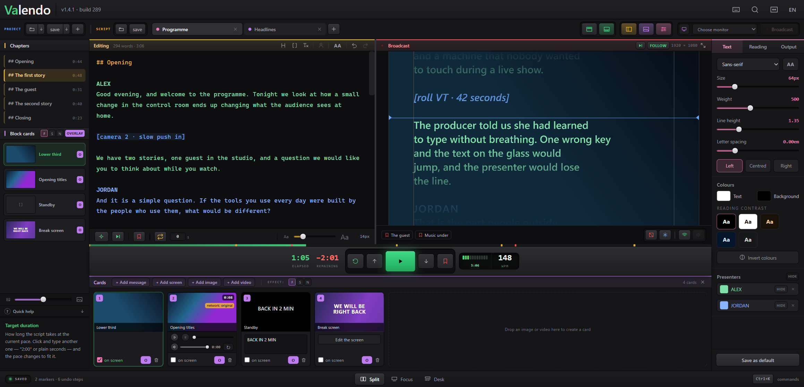
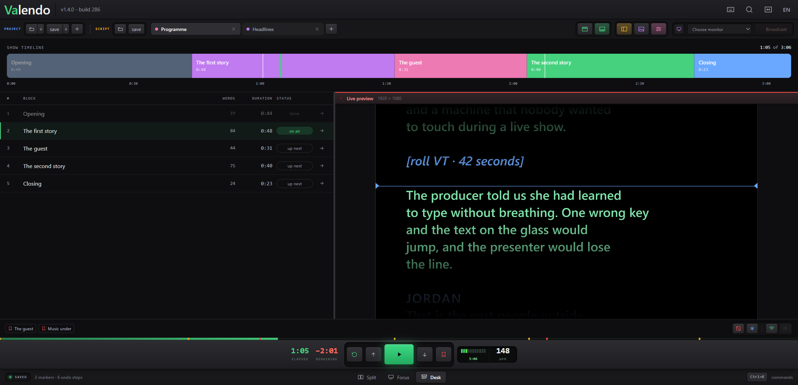
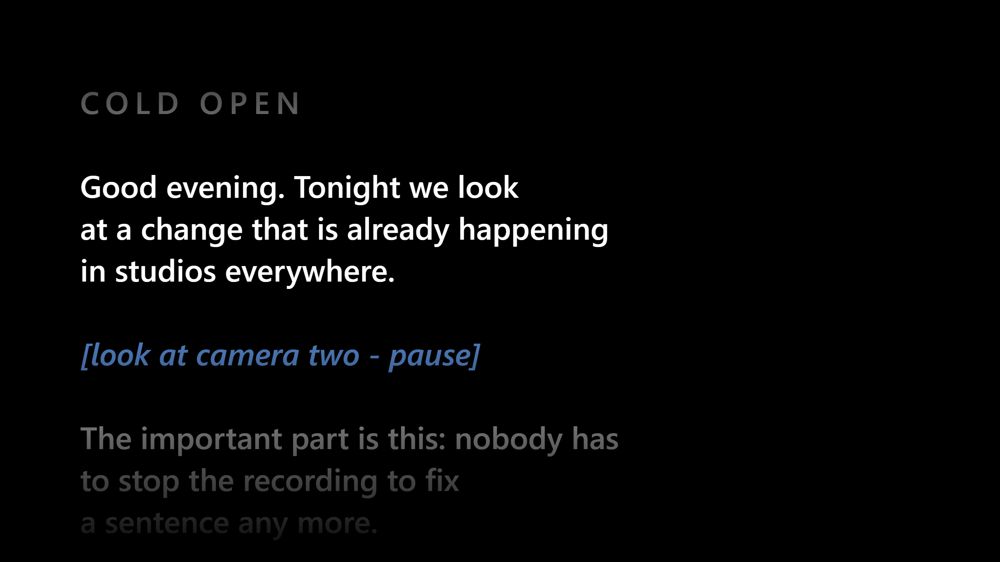
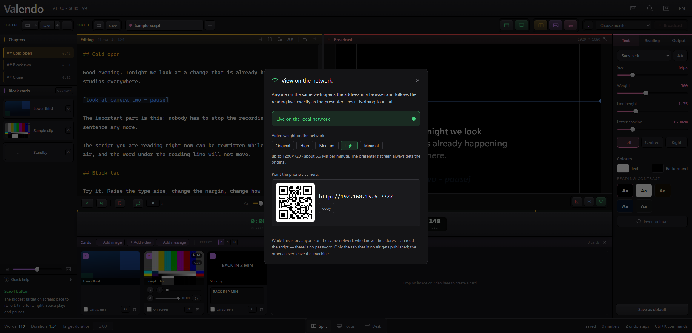
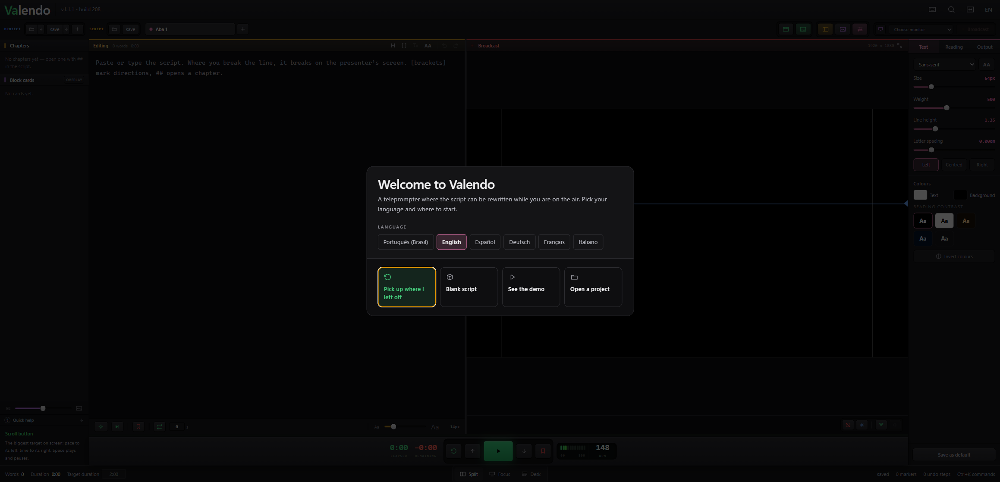

# Valendo — A Teleprompter Suite

A teleprompter for Windows and macOS where the operator **rewrites the script while the show is on the air**, watching the editor and an exact replica of the presenter's screen side by side.

> The reading position is an anchor in the text, not a pixel on the screen.



**[valendo site →](https://samabr85.github.io/Valendo-TeleprompterSuite/)** · **[Documentation is in the wiki →](https://github.com/samaBR85/Valendo-TeleprompterSuite/wiki)**

---

## Why it exists

Ordinary teleprompters store the scroll position **in pixels**. Any change to the text, the typeface or the margin reflows the layout, and pixel 4,200 is suddenly a different sentence — the text jumps in the presenter's face. That is why those apps make you leave the presentation screen to edit.

Here the position is a **semantic anchor**: `{ blockId, wordOffset }`. After any reflow the pixel is recomputed from it. Inserting paragraphs above the reading point, raising the type size or changing the margin does not move the word being read.

[The Reading Anchor](https://github.com/samaBR85/Valendo-TeleprompterSuite/wiki/The-Reading-Anchor) explains what follows from that — a clock instead of messages, one component drawing both screens, and lines composed by words rather than by the browser.

---

## What it does

### Live editing, on air

The left panel is the script; the right panel is what the presenter sees, at the output's real resolution. `##` opens a chapter, `[square brackets]` mark a stage direction.

### Cards over or under the script



Images, video and messages go to the presenter's screen with one click or a number key. Each card either **replaces** the script or **rides over it**, which is how a lower third and a caption share the same screen. Legibility over a card is a three-way choice: dark band, per-letter shadow, or nothing.



Video plays the file as it arrived whenever the browser can handle it. When it cannot, ffmpeg first tries to change only the container — seconds, no pixel touched — and re-encodes only when the content genuinely will not fit an mp4.

### Three ways to work

**Split** is the picture at the top. **Focus** hides everything except the script and the transport. **Desk** turns the script into a rundown with a timeline.



### The presenter's screen



Any connected monitor, identified on screen before you send a show to it. Mirror on either axis, 90° rotation, blackout and freeze. Survives a monitor being unplugged mid-show.

### Anyone on the wi-fi can follow along



One switch publishes the reading to a local page. A phone points its camera at the QR code and follows the same scroll, cards included. Video to the network can be throttled; the presenter's screen always gets the original.

### It opens without opening your work



The app never restores the last script by itself. Opening Valendo in someone else's studio, or with the screen already mirrored to a wall, would otherwise reveal the previous show without anyone asking — and a script is a client's material. The screen starts blank and **Pick up where I left off** is a deliberate click.

---

## Feature list

| Area | What is there |
|---|---|
| Reading | Semantic anchor, word-rule line composition, reading line, chapters, markers, go-to-cursor |
| Transport | Play/pause, WPM ruler, nudge, seek by words, restart, loop with delay, auto-pause at the end |
| Pacing | Formula (words ÷ WPM), stopwatch, free run; elapsed, remaining and target duration |
| Appearance | Family, size, weight, line height, letter spacing, ALL CAPS, margin, horizontal position, words per line, alignment, colour presets, invert, reading-contrast swatches |
| Output | Monitor picker, identify displays, hot-plug survival, mirror X/Y, rotation, blackout, freeze |
| Cards | Image, video, message; overlay per card and globally; band/shadow/none; drag to reorder; video scrub, loop, volume, relink |
| Network | Local page with QR, five video weight profiles, only the on-air tab is published |
| Files | Import `txt` `md` `docx` `pdf`; export `txt` `md` `docx` `pdf`; `.valendo` projects; recent projects; autosave |
| Editing | Infinite undo, persisted across sessions; strip formatting; up to 10 tabs |
| Console | Command palette, remappable keys, UI scale, transport at the top or in the footer bar |
| Languages | English, Portuguese (Brazil), Spanish, German, French, Italian |

---

## Install

**Windows** — run `Valendo-1.0.0-setup.exe`. It installs per user, so it does not ask for an administrator password.

**From source** —

```bash
npm install
npm run dev
```

Everything else a contributor needs — the other commands, the project layout, the tests, where user data lives — is in [Building from Source](https://github.com/samaBR85/Valendo-TeleprompterSuite/wiki/Building-from-Source).

---

## Licence

GNU General Public License, version 3 or later — the full text is in [LICENSE](LICENSE).

In plain words: you may use, study, modify and redistribute Valendo freely, including in a studio that charges for the work. The one obligation appears when you **distribute** a modified version — its source has to travel with it, under this same licence.

That is the intent of the project: it was born to stay free. The GPL does not stop anyone from charging, but it does stop anyone from closing the source and turning this into a proprietary product.

The installer redistributes a **GPL build of ffmpeg 6.1.1**; the corresponding source and build flags are listed in [Building from Source](https://github.com/samaBR85/Valendo-TeleprompterSuite/wiki/Building-from-Source#redistributed-ffmpeg).
